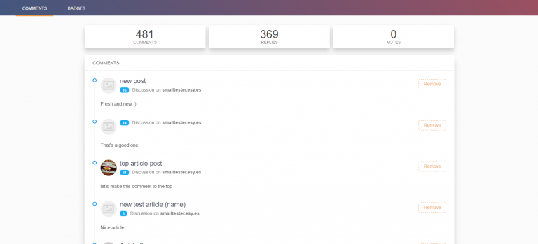
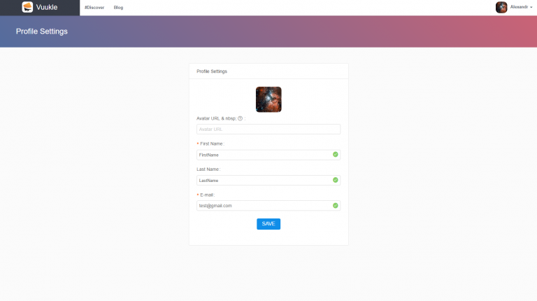

<iframe width="560" height="315" src="https://www.youtube.com/embed/Qn441_nkgcI" frameborder="0" allowfullscreen></iframe>

To edit your Vuukle profile you need to Log into your personal page http://vuukle.com/user/login

If you don’t have a password and don’t know where to get it, Click here

On your profile page, you can manage all your comments, view articles where you commented before.

You can remove your comments by pressing “Remove” button.

In profile settings, you can change your Avatar, First Name, Last Name and Email address.

All changes that you will make to your profile will automatically apply to all your comments.

Also, you can track your progress as a Commenter – the more you comment, the higher is your score.
