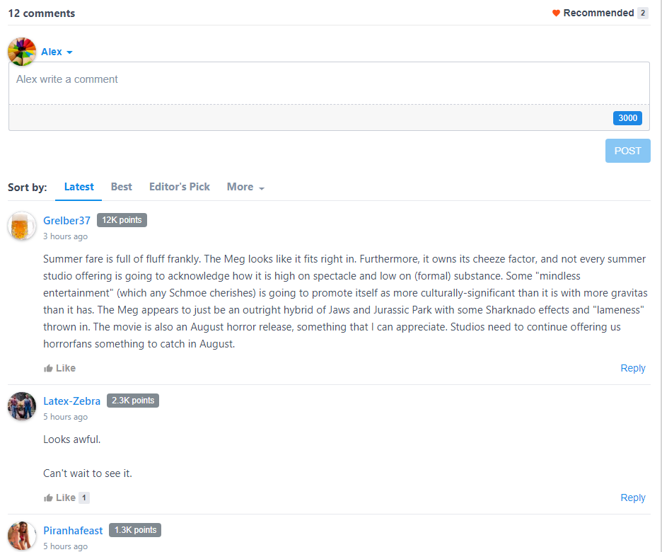
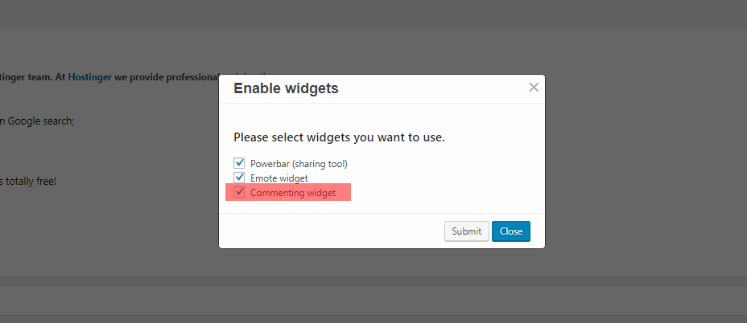

## HOW TO ENABLE

### Enable Vuukle Comment widget using WordPress plugin:

In your WordPress Admin panel, go into Settings > Vuukle and choose On for "Enable comments" in the "Advanced settings"



OR


### For Blogger:

It's auto enabled in blogger, please check [integration article](https://docs.vuukle.com/how-to-install-vuukle-on-a-blogger-blog/)

You can disable comment widget by editing JS parameters in Blogger template.

More information below in **JS variables** section.

### For JavaScript:

In your website�s HTML, insert the following code where you want the Comments widget to display

```javascript
<div id="vuukle-comments" />
```

---

## HOW TO CUSTOMIZE

### JS variables:

```html
var VUUKLE_CONFIG = { comments: { transliteration: { //Enables transliteration language: "en", enabledByDefault: true, }, auth: { facebook: false,
google: false, twitter: false, disqus: true, password: true, vuukle: true, }, hideRecommendedArticles: false, //Hides "Talk of the town" section
hideMoreNews: true, // hide button 'Show more articles' hideCommentInputBox: false, // Hides Comment input field ( can be expanded by pressing on the
" add comment button") enabled: true, //Enables comment widget commentingClosed: false, // Closes commenting (Users can view already posted comments
but can't post new ones) maxChars: 3000, //Comment char limit (You can set a limit up to 3000 characters) countToLoad: 10, // number of comments to
load initialy on the page toxicityLimit: 80, // 1-99 - you can set how strict is the automoderation. 100 - disables the parameter sorting: latest /
oldest //sorts by latest or oldest comments on initial loading customText: {}, // please check this article for custom texts
https://docs.vuukle.com/how-to-do-language-customizations-if-using-js- implementation/ }, theme: { color: "#10e9ba", darkMode: true, }, },
```

### WordPress Settings

Same as the JS variable list but with User friendly settings look:


