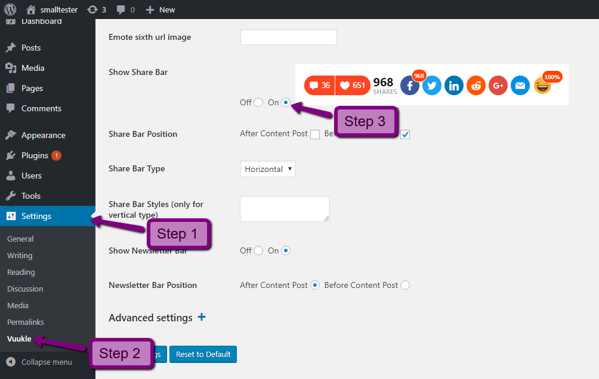
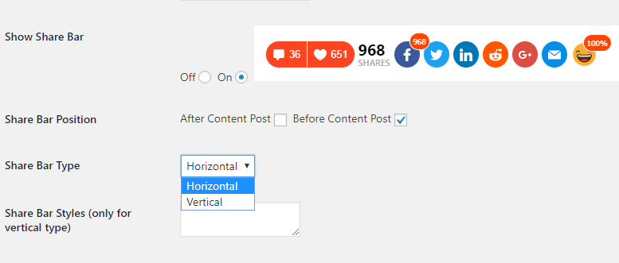
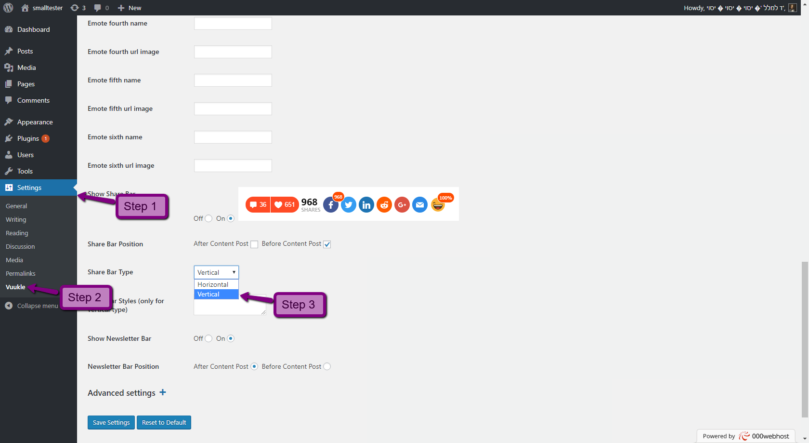
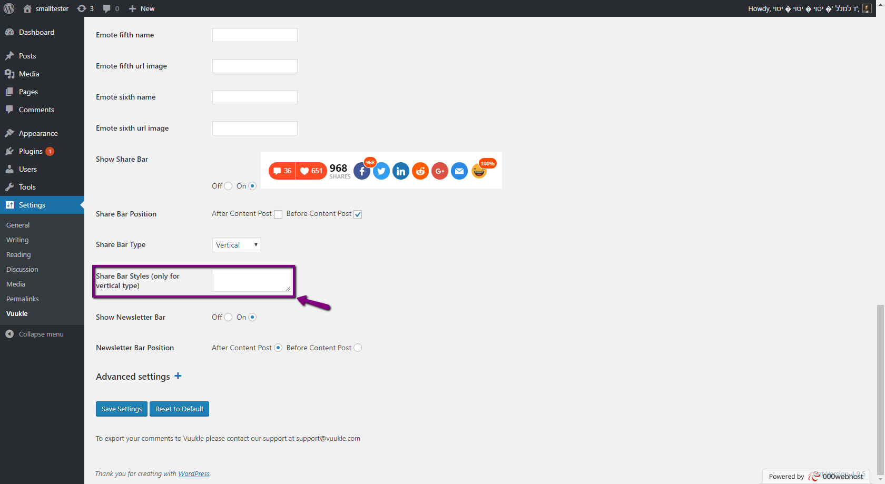

## HOW TO ENABLE

### Enable Vuukle PowerBar widget using WordPress plugin:

In your WordPress Admin panel, go into Settings > Vuukle and choose On for Show Share Bar



### For Blogger:

In your Blogger dashboard, go into Layout tab, edit the Vuukle HTML/JavaScript widget and insert the shortcode `[vuukle-powerbar]`. Then click the Save button.

### For JavaScript:

In your website’s HTML, insert the following code where you want the PowerBar widget to display

```javascript
<div class="vuukle-powerbar"></div>
<div class="vuukle-powerbar-vertical"></div> - Use this div for vertical mode
```

---

## HOW TO CUSTOMIZE

### JS variables:

```html
powerbar: { enabled: false, //Enables PowerBar widget on the page defaultEmote: 2, //Setting shown emote by default verticalPosition: '400px', //
Space from top for veritcal powerbar
```

### WordPress Settings

Wordpress Powerbar Settings:



### Change PowerBar widget type using WordPress plugin:

In your WordPress Admin panel, go into Settings > Vuukle, click on the Share Bar Type settings and choose Vertical.

Put CSS styles for Share Bar Styles (only for vertical type) to place the PowerBar as you like


