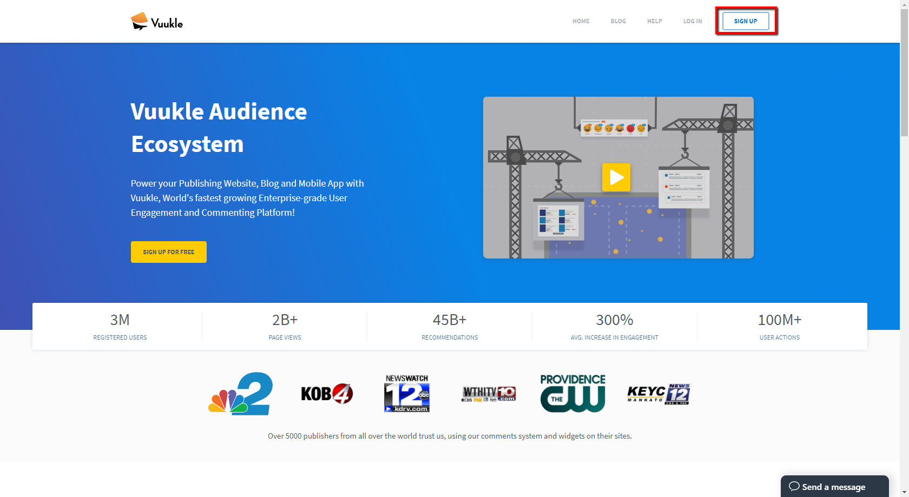
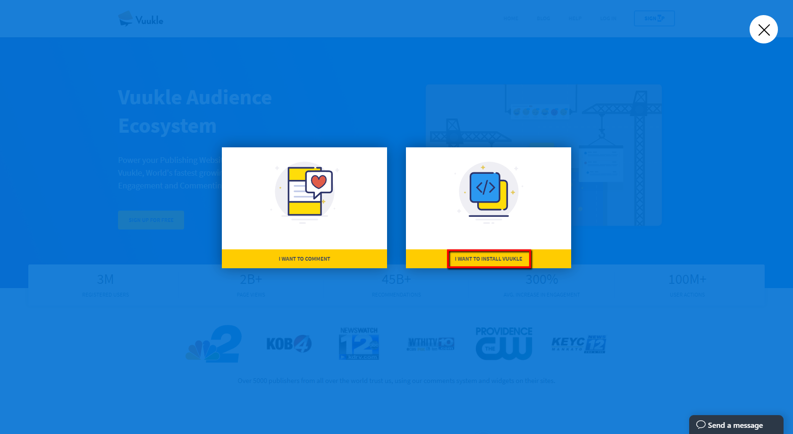
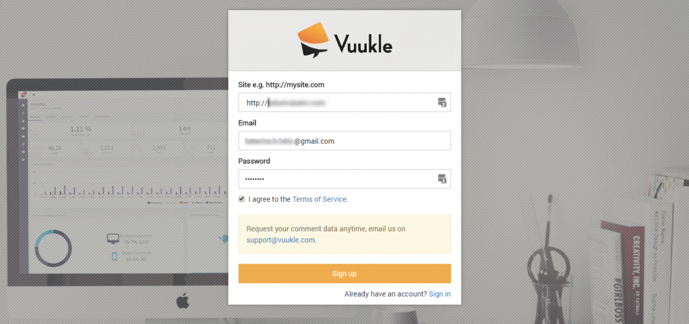
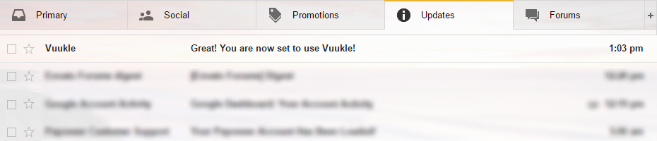

To create publisher account, you should visit our home page – [vuukle.com](http://vuukle.com/) and click Sign Up in top right corner.

On the form that shows up, enter your site address with “http://” prefix, email address and password. Read our Terms of Service and select check box on the left side. Click on Sign Upbutton on the form.

After that, you will be redirected to your admin panel – [vuukle.com/admin/](http://vuukle.com/admin/), and you will receive email confirming that you created account.

## Step by step instructions with screenshots explaining how to create publisher account

1. Visit home page, vuukle.com, and click Sign Up

   

2. Click on "WANT TO INSTALL VUUKLE"

   

3. Enter your site address with “http://” prefix, email address and password.
   

4. Check your confirmation email
   
